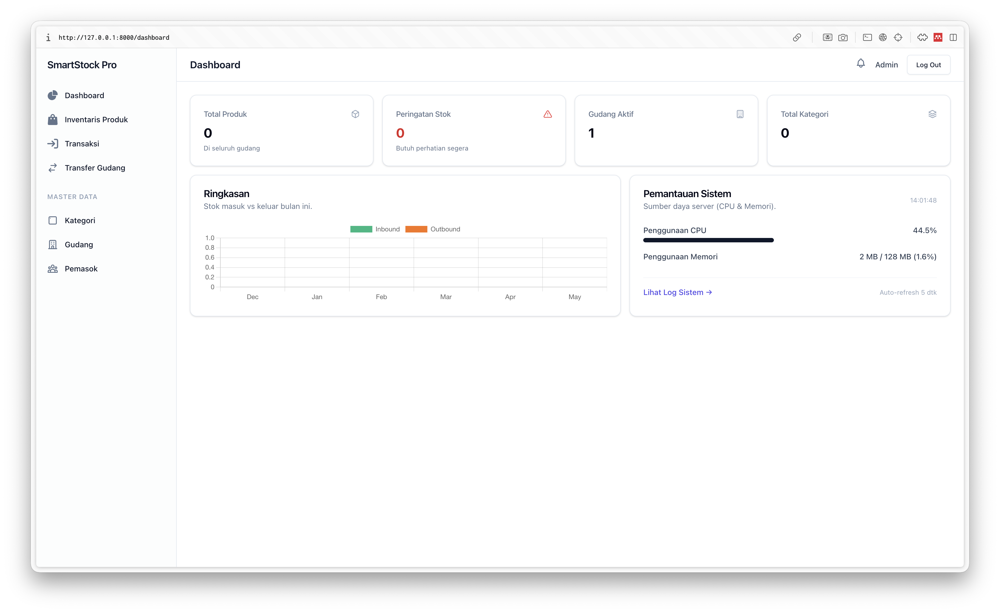
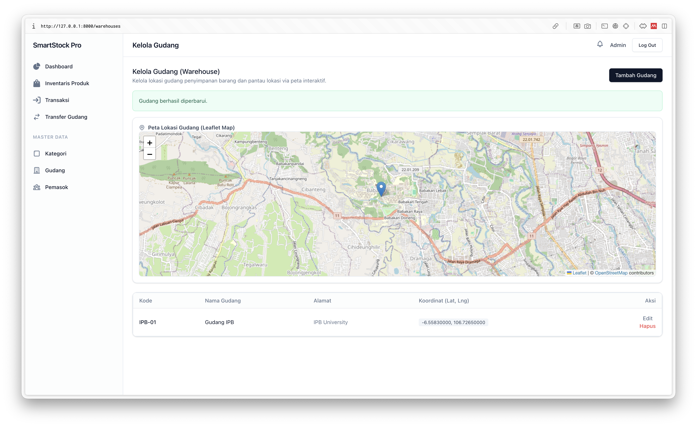

# SmartStock Pro

Sistem Manajemen Inventaris berbasis web untuk PT Maju Bersama Digital, dibangun di atas **Laravel 12** dan **PostgreSQL 16**.  
Dikembangkan oleh **Raihan Putra Kirana** untuk memenuhi prasyarat sertifikasi BNSP.  
Repository: [github.com/raihanpka/smartstockpro-bnsp](https://github.com/raihanpka/smartstockpro-bnsp)

## Tampilan Aplikasi

| Dashboard Utama | Peta Lokasi dan Manajemen Gudang |
| :---: | :---: |
|  |  |

---

## Deskripsi

SmartStock Pro menggantikan proses pencatatan stok manual berbasis spreadsheet dengan satu platform terpusat yang dapat diakses oleh seluruh gudang secara bersamaan. Sistem ini mencakup manajemen stok real-time, transfer barang antar gudang, notifikasi otomatis, dan pelaporan berbasis data untuk mendukung pengambilan keputusan manajemen.

PT Maju Bersama Digital mengoperasikan **5 gudang** di Jakarta, Surabaya, Bandung, Medan, dan Makassar. SmartStock Pro menyatukan operasional kelima lokasi tersebut ke dalam satu antarmuka yang konsisten.

---

## Fitur Utama

### Modul 1: Autentikasi & Keamanan
- Login multi-level: **Admin**, **Manajer Gudang**, **Staf Gudang**, **Viewer**
- Role-based access control diterapkan di seluruh route via `RoleMiddleware`
- Password hashing bcrypt dengan validasi kekuatan (min. 8 karakter, huruf besar/kecil, angka, simbol)
- Proteksi CSRF (token di setiap form), SQL Injection (Eloquent ORM), dan XSS (Blade auto-escape)
- Session timeout otomatis setelah 120 menit
- **Audit Log** seluruh aktivitas: login, logout, registrasi, CRUD produk/transaksi/transfer — via `AuditObserver` dan `AuditLog::record()`

### Modul 2: Dashboard & Real-Time Monitoring
- Grafik interaktif tren stok masuk/keluar 6 bulan terakhir (Chart.js)
- **Peta lokasi gudang interaktif** menggunakan Leaflet.js + OpenStreetMap (marker + popup info)
- **Panel monitoring server** (CPU load, RAM usage) yang **auto-refresh setiap 5 detik** via polling AJAX ke endpoint `/metrics`
- Galeri produk dengan upload & preview gambar
- Alert tabel stok kritis langsung di dashboard
- Export laporan PDF dengan header berwarna, summary cards, tabel produk, dan tabel transaksi (via `barryvdh/laravel-dompdf`)
- System Logs UI dengan kategorisasi severity: **Critical / Warning / Info**

### Modul 3: Manajemen Inventaris (CRUD)
- CRUD lengkap: **Produk** (+ upload gambar), **Kategori**, **Gudang**, **Supplier**, **Transaksi Masuk/Keluar**
- Search produk berdasarkan nama / SKU
- Filter: gudang, kategori, stok kritis saja
- Sorting: nama, SKU, stok, terbaru — arah naik/turun
- Pagination dengan query string preserved
- Algoritma **FIFO** (First-In First-Out) untuk deduction stok keluar

### Modul 4: Sistem Notifikasi & Alert
- **Notification bell** di header dengan badge counter merah — menampilkan unread `LowStockAlert`
- Alert otomatis in-app ketika stok produk di bawah `min_stock` (via Laravel Notifications → channel `database`)
- Middleware `PerformanceMonitor` mencatat request lambat (> 1000ms) ke log
- Dashboard Log Error dengan kategorisasi severity dari `storage/logs/laravel.log`

### Modul 5: Pemrosesan Paralel & Transfer
- Transfer barang antar gudang: alur **request → approve → execute** via background job (`TransferStockJob`)
- Batch import produk dari **CSV / Excel** — file disimpan, lalu diproses oleh `ImportProductsJob` (queue)
- Background job generate laporan PDF besar tanpa memblokir UI (`GenerateReportJob`)
- **Queue driver:** `sync` (in-memory, tanpa worker) untuk development; `database` untuk production Docker

---

## Tech Stack

| Layer | Teknologi | Versi |
|---|---|---|
| Backend | Laravel | 12.x |
| Runtime | PHP | 8.4 |
| Database | PostgreSQL | 16 |
| Queue | Laravel Queue (sync / database) | Native |
| Frontend | Blade + Alpine.js | Alpine 3.x |
| Styling | Tailwind CSS | 3.x |
| Maps | Leaflet.js + OpenStreetMap | 1.9.x |
| Charts | Chart.js | 4.x |
| PDF Export | barryvdh/laravel-dompdf | 3.x |
| File Import | Maatwebsite/Laravel-Excel | 3.x |
| Web Server | Nginx (Docker) | 1.27 |
| Container | Docker + Docker Compose | V2 |

---

## Prasyarat

### Development Lokal

| Prasyarat | Versi Minimum |
|---|---|
| PHP | 8.3+ |
| Composer | 2.x |
| Node.js | 20.x |
| NPM | 10.x |
| PostgreSQL | 16 |

> **Tidak perlu Redis.** Queue dan cache menggunakan database (PostgreSQL) atau `sync` (in-memory).

### Production / Docker

| Prasyarat | Keterangan |
|---|---|
| Docker | 24+ |
| Docker Compose | V2 (plugin, bukan standalone) |

---

## Instalasi

### Quick Start — Development Lokal

```bash
# 1. Clone & masuk ke direktori
git clone https://github.com/raihanpka/smartstockpro-bnsp.git
cd smartstockpro-bnsp

# 2. Salin environment file
cp .env.example .env

# 3. Sesuaikan .env untuk koneksi PostgreSQL lokal, lalu:
composer install
php artisan key:generate
php artisan migrate --seed

# 4. Install & build frontend
npm install
npm run build

# 5. Jalankan server
php artisan serve
```

Akses di `http://localhost:8000`.

> **Untuk development tanpa PostgreSQL:** ganti `DB_CONNECTION=sqlite` di `.env` dan hapus baris `DB_HOST/PORT/DATABASE/USERNAME/PASSWORD`. Laravel akan membuat file `database/database.sqlite` secara otomatis.

> **Queue di development:** default `QUEUE_CONNECTION=sync` — semua job dieksekusi langsung tanpa worker terpisah.

---

### Mac — Laravel Herd

1. Install [Laravel Herd](https://herd.laravel.com/) dan aktifkan.
2. Pindahkan folder project ke `~/Herd/`. Herd otomatis melayani di `http://smartstockpro-bnsp.test`.
3. Install PostgreSQL via [DBngin](https://dbngin.com/) atau Homebrew:
   ```bash
   brew install postgresql@16
   brew services start postgresql@16
   psql -U postgres -c "CREATE DATABASE smartstock_pro;"
   ```
4. Ikuti langkah **Quick Start** di atas (lewati `php artisan serve`).

---

### Windows — Laragon

1. Install [Laragon](https://laragon.org/) dengan PHP 8.3+ dan Node.js 20.
2. Install PostgreSQL 16 dari [postgresql.org](https://www.postgresql.org/download/windows/).
3. Buka terminal Laragon dan ikuti langkah **Quick Start**.

---

### Production, Docker (VPS / Server Sendiri)

```bash
# 1. Clone repository
git clone https://github.com/raihanpka/smartstockpro-bnsp.git /var/www/smartstockpro
cd /var/www/smartstockpro

# 2. Salin dan isi .env production
cp .env.example .env
# Edit minimal: APP_KEY (generate dulu), DB_PASSWORD, APP_URL

# 3. Generate APP_KEY
docker run --rm -v $(pwd):/app -w /app php:8.4-cli php artisan key:generate

# 4. Build dan jalankan semua container
docker compose up -d --build
```

Container yang berjalan:
| Container | Peran |
|---|---|
| `smartstock_db` | PostgreSQL 16 |
| `smartstock_app` | PHP-FPM 8.4 (menjalankan migrate + seed otomatis) |
| `smartstock_nginx` | Nginx — reverse proxy ke PHP-FPM, port `8080` |
| `smartstock_worker` | Queue worker untuk background jobs |

Akses di `http://your-server:8080`.

---

## Akun Default (Seeder)

Setelah `php artisan db:seed` atau Docker startup:

| Email | Password | Role |
|---|---|---|
| `admin@smartstockpro.id` | `#Admin123` | Admin |

> **Catatan:** Password `#Admin123` diset via seeder. Untuk akun baru via form registrasi, gunakan password yang memenuhi syarat: min. 8 karakter, huruf besar/kecil, angka, dan simbol.

---

## Struktur Queue

| Driver | Kapan digunakan | Worker diperlukan? |
|---|---|---|
| `sync` | Development lokal | ❌ Tidak |
| `database` | Production (Docker/VPS) | ✅ Ya (container `worker`) |

Jobs yang berjalan di background:
- `TransferStockJob` — eksekusi transfer stok antar gudang
- `ImportProductsJob` — proses batch import CSV/Excel
- `GenerateReportJob` — generate laporan PDF besar

---

## Dokumentasi

| Dokumen | Isi |
|---|---|
| [`01_Dokumen_Kebutuhan_NonFungsional.docx`](01_Dokumen_Kebutuhan_NonFungsional.docx) | Arsitektur, spesifikasi server, analisis tools, skalabilitas |
| [`02_Dokumen_Migrasi_dan_Pembaharuan.docx`](02_Dokumen_Migrasi_dan_Pembaharuan.docx) | Strategi migrasi dari spreadsheet, cutover plan, git workflow, impact analysis |
| [`03_Dokumentasi_Teknis_Pelanggan.docx`](03_Dokumentasi_Teknis_Pelanggan.docx) | Panduan pengguna, FAQ, dokumentasi API, troubleshooting |

---

## Kredit

Dikembangkan oleh **Raihan Putra Kirana (G6401231027)** untuk memenuhi prasyarat sertifikasi BNSP.
