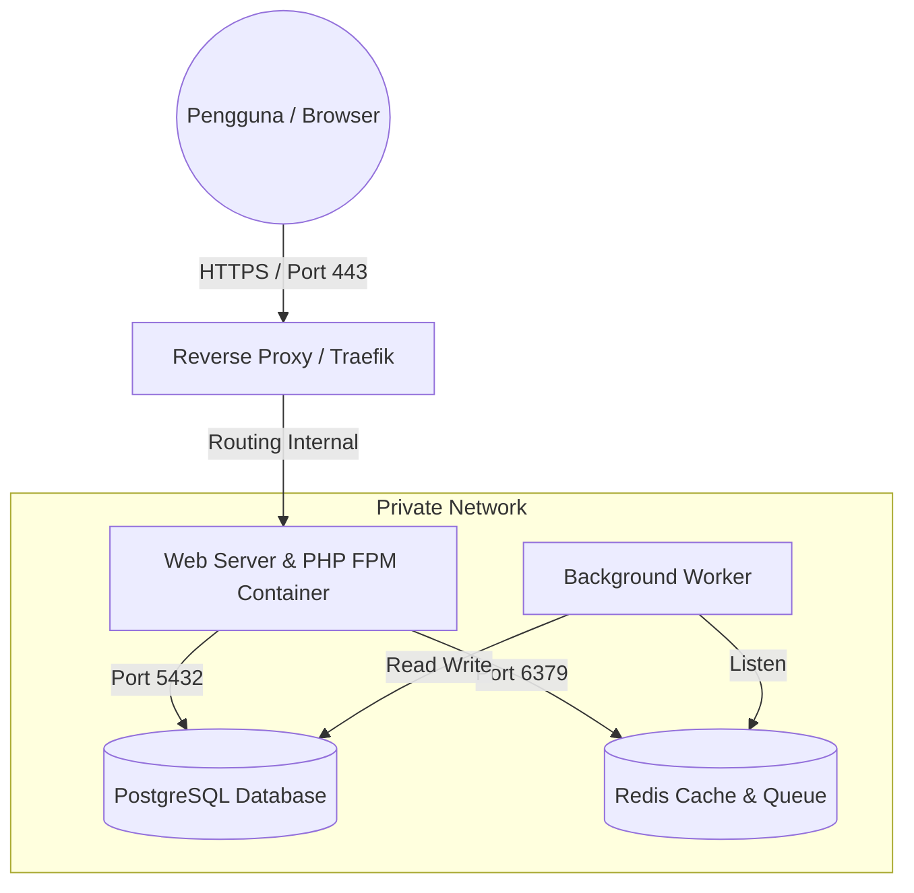

# SmartStock Pro - Arsitektur dan Infrastruktur

- **Versi Dokumen**: 1.0
- **Terakhir Diperbarui**: Mei 2026
- **Proyek**: SmartStock Pro, Sistem Manajemen Inventaris
- **Klien**: PT Maju Bersama Digital

---

## Daftar Isi

1. [Glosarium](#glosarium)
2. [Topologi Arsitektur Perangkat Keras](#topologi-arsitektur-perangkat-keras)
3. [Spesifikasi Minimum Server](#spesifikasi-minimum-server)
4. [Arsitektur Perangkat Lunak (Aplikasi)](#arsitektur-perangkat-lunak-aplikasi)

---

## Glosarium

| Istilah | Definisi |
|---|---|
| **Container** | Lingkungan eksekusi terisolasi yang mengemas aplikasi beserta seluruh dependensinya. |
| **Reverse Proxy** | Server perantara yang meneruskan permintaan klien ke satu atau beberapa server backend (misalnya Nginx atau Traefik). |
| **NVMe SSD** | Media penyimpanan dengan protokol Non Volatile Memory Express yang menawarkan kecepatan baca tulis ekstrim. |
| **MVC** | Model View Controller, pola arsitektur pemisah struktur kode aplikasi menjadi bagian Data, Tampilan, dan Logika perantara. |

## 1. Topologi Arsitektur Perangkat Keras

Sistem SmartStock Pro dirancang menggunakan arsitektur berbasis container (Docker) untuk memastikan isolasi, keamanan, dan kemudahan dalam replikasi lingkungan produksi. Berikut adalah gambaran topologi server dan jaringan yang direkomendasikan.

Topologi di atas memisahkan jalur akses publik dengan jaringan privat. Komunikasi ke Database dan Cache murni terjadi di dalam jaringan privat Docker (Docker Network) yang tidak diekspos secara langsung ke internet luar. Ini memberikan lapisan perlindungan berlapis di mana penyerang luar tidak bisa mengakses peladen basis data secara langsung tanpa menembus wadah Reverse Proxy terlebih dahulu.

## 2. Spesifikasi Minimum Server

Untuk melayani operasional 5 gudang utama PT Maju Bersama Digital secara efisien (Jakarta, Surabaya, Bandung, Medan, dan Makassar), spesifikasi minimum server produksi yang disarankan dibagi ke dalam dua komponen utama jika dideploy dalam kluster berbeda, atau dapat dijadikan panduan ukuran peladen tunggal (Monolith):

### 2.1 Application Server (Web & Worker)
Application Server bertugas murni memproses kalkulasi PHP (FPM) dan menjalankan antrian pekerja (Queue Worker) di latar belakang.
* **Prosesor**: Minimal 2 Core (Rekomendasi 4 Core vCPU untuk kelancaran rendering laporan berat).
* **RAM**: Minimal 4 GB (Rekomendasi 8 GB untuk konkurensi tinggi dan sesi PHP).
* **Storage**: 50 GB NVMe SSD. Digunakan untuk menyimpan sistem operasi, kode sumber, dan berkas unggahan gambar produk (Public Storage) serta log aplikasi temporer.
* **Bandwidth**: 100 Mbps Public Network.

### 2.2 Database Server (PostgreSQL & Redis)
Bagian ini khusus digunakan untuk penyimpanan presisten dan tembolok data cepat. Pada arsitektur Docker Compose kita, ini adalah servis penopang yang berjalan di belakang layar.
* **Prosesor**: Minimal 2 Core.
* **RAM**: Minimal 4 GB. Sebagian besar Random Access Memory ini didedikasikan untuk Redis (in memory caching) dan indeks pencarian PostgreSQL yang sangat memakan memori untuk menjamin waktu pencarian kilat.
* **Storage**: 100 GB NVMe SSD. Pertumbuhan log audit aplikasi dan ribuan transaksi stok harian dari 5 kota membutuhkan landasan diska keras yang besar dan cepat.
* **Network**: 1 Gbps Private LAN (jika menggunakan peladen fisik terpisah) agar komunikasi internal (I/O throughput) ke Application Server tidak tercekik oleh keterbatasan jaringan.

## 3. Arsitektur Perangkat Lunak (Aplikasi)

Pada level aplikasi, SmartStock Pro dibangun menggunakan pola arsitektur **MVC (Model View Controller)** yang diperluas dengan **Service Layer**. Pendekatan berlapis (Layered Architecture) ini dipilih untuk menegakkan prinsip pemisahan tanggung jawab secara mutlak, sehingga kode tetap bersih (*Clean*) dan mudah dipelihara manakala logika bisnis perusahaan semakin rumit.

### 3.1 Model Layer (Data & ORM)
Terletak secara eksklusif di direktori `app/Models/`, lapisan ini murni bertugas sebagai representasi entitas basis data dan memetakan relasi antar entitas (Object Relational Mapping).
* **Contoh Entitas**: `Product`, `Warehouse`, `StockTransaction`.
* Lapisan ini sama sekali tidak menampung logika bisnis kompleks. Perannya dibatasi pada ruang lingkup pangkalan data, seperti pengaturan metode *Eager Loading* bawaan, *Mutators*, serta penentuan atribut `fillable` untuk menutup celah kerentanan injeksi data (*Mass Assignment*).

### 3.2 View Layer (Presentasi Antarmuka)
Terletak di direktori `resources/views/`, lapisan ini mendayagunakan mesin templat Blade untuk merajut HTML secara dinamis sebelum dikirim ke peramban.
* Komponen antarmuka dipecah menjadi fragmen berdikari (seperti `<x-table>` atau `<x-badge>`) agar dapat disisipkan berulang kali (Reusable Components) demi konsistensi tampilan *New York style*.
* Logika presentasi dilarang keras memanggil kueri basis data secara langsung. Lapisan View pasif; hanya menerima dan melukis variabel yang disuapkan oleh *Controller*.

### 3.3 Controller Layer (Pengarah Rute HTTP)
Terletak di `app/Http/Controllers/`, Controller memegang peran layaknya kondektur lalu lintas.
* **Tanggung Jawab**: Merespons permintaan (HTTP Request), memastikan pengguna telah terautentikasi melalui *Middleware*, memvalidasi kesucian data masukan (*Form Requests*), untuk kemudian **mendelegasikan** pekerjaan berat tersebut ke Service Layer.
* Dirancang agar tetap "kurus" (Thin Controllers). Tidak ada kalkulasi matematis atau aturan bisnis perusahaan yang ditulis di sini. Setelah Service Layer menuntaskan misinya, Controller sekadar mengembalikan instruksi pengalihan halaman (*Redirect*) atau menyodorkan berkas View.

### 3.4 Service Layer (Business Logic)
Terletak di `app/Services/`, ini adalah jantung intelektual aplikasi, mengadopsi spirit dari *Clean Architecture*.
* **Contoh Representasi**: `StockCalculationService`.
* Segala aturan bisnis yang pelik (seperti rumitnya kalkulasi algoritma FIFO pemotongan persediaan, evaluasi batas minimum stok, hingga orkestrasi pencatatan log transaksi antar tabel) dienkapsulasi rapat di dalam Service. Pendekatan ini membuat logika bisnis PT Maju Bersama Digital dapat dieksekusi dari gerbang mana saja (entah itu dari *Web Controller*, terminal antarmuka *Command Line*, ataupun pekerjaan latar belakang *Cron Job*) tanpa perlu menduplikasi sebaris kode pun.
